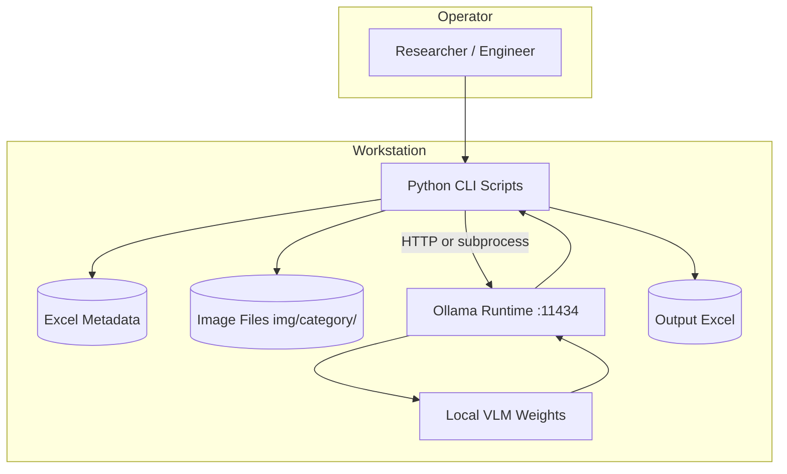
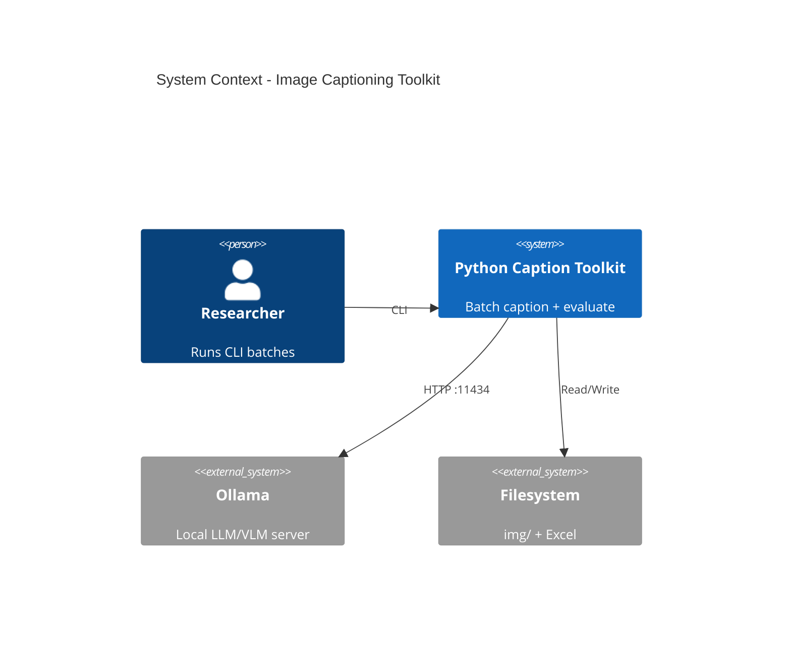
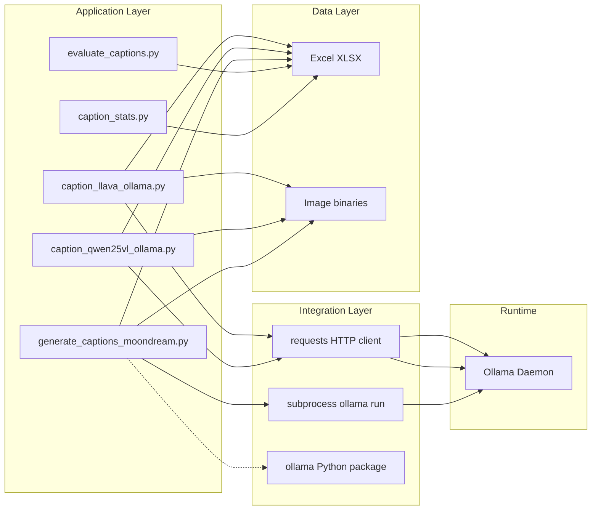
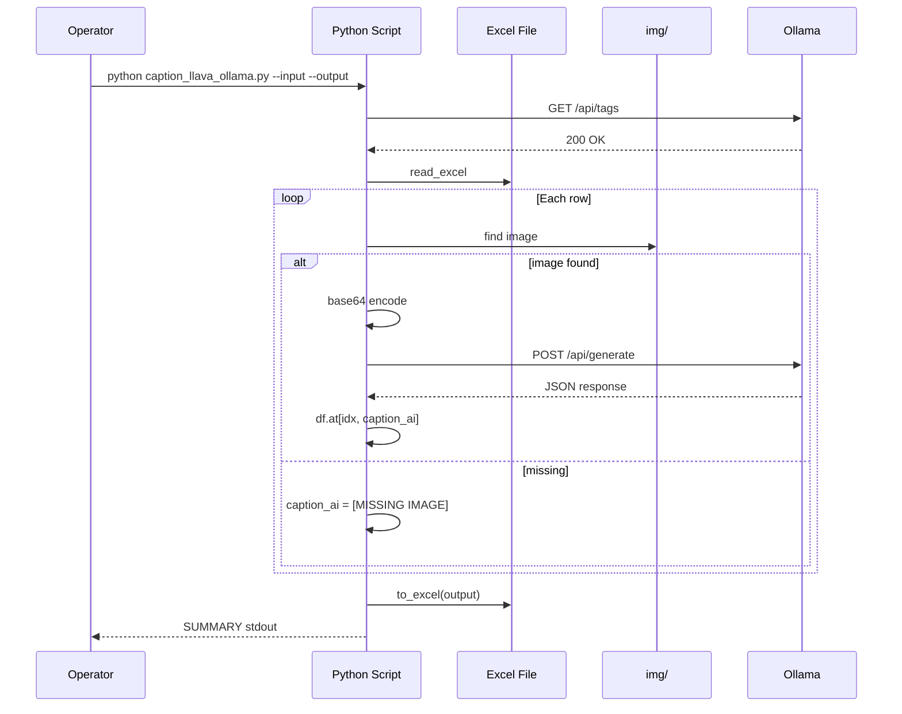
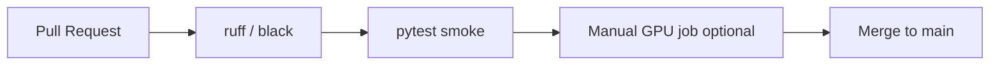
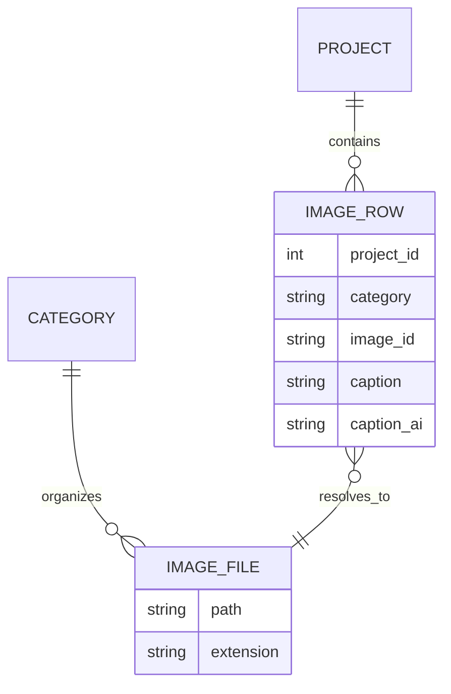
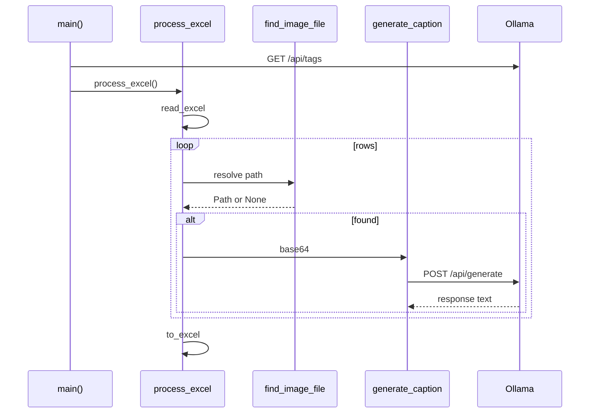

# Image Captioning for ITE Project Documentation — Technical Documentation

**Document version:** 1.0  
**Last updated:** 2026-05-20  
**Repository:** `image-captioning`  
**Maintainer (inferred):** ITE / Forschungszentrum Jülich (Osama Hamed et al.)  
**License:** MIT (Copyright © 2025 Osama Hamed)

---

# Table of Contents

- [1. Executive Summary](#1-executive-summary)
- [2. Project Overview](#2-project-overview)
- [3. System Architecture](#3-system-architecture)
  - [Architecture Style](#architecture-style)
  - [High-Level Architecture](#high-level-architecture)
  - [Internal Architecture](#internal-architecture)
- [4. Technology Stack](#4-technology-stack)
- [5. Project Structure](#5-project-structure)
- [6. Environment Setup](#6-environment-setup)
- [7. Runtime Environment](#7-runtime-environment)
- [8. CI/CD Pipeline](#8-cicd-pipeline)
- [9. Database Documentation](#9-database-documentation)
- [10. API Documentation](#10-api-documentation)
- [11. Internal Execution Flow](#11-internal-execution-flow)
- [12. Codebase Walkthrough](#12-codebase-walkthrough)
- [13. Deployment Guide](#13-deployment-guide)
- [14. Monitoring & Observability](#14-monitoring--observability)
- [15. Testing Strategy](#15-testing-strategy)
- [16. Security Architecture](#16-security-architecture)
- [17. Performance & Scalability](#17-performance--scalability)
- [18. Troubleshooting Guide](#18-troubleshooting-guide)
- [19. Technical Debt & Future Improvements](#19-technical-debt--future-improvements)
- [Appendix A: Ollama HTTP Contract](#appendix-a-ollama-http-contract)
- [Appendix B: Script Comparison Matrix](#appendix-b-script-comparison-matrix)
- [Appendix C: Assumptions & Gaps](#appendix-c-assumptions--gaps)

---

# 1. Executive Summary

## What the project is

**Image Captioning for ITE Project Documentation** is a **research and batch-processing toolkit** that automatically generates **technical English captions** for historical engineering lab photographs. It integrates **local Vision-Language Models (VLMs)** through **[Ollama](https://ollama.ai)** and persists results in **Excel workbooks** alongside human-written ground-truth captions.

The system is **not** a web application, microservice platform, or database-backed product. It is a **modular monolith of standalone Python CLI scripts** orchestrated manually by researchers or operators on a workstation (primarily **Windows**).

## Business objective

| Objective | Description |
|-----------|-------------|
| **Documentation automation** | Reduce manual effort required to caption thousands of unlabeled project archive images at ITE (Institute of Technology and Engineering, Forschungszentrum Jülich). |
| **On-premise AI** | Run captioning **locally** without sending sensitive lab imagery to external cloud APIs. |
| **Model benchmarking** | Compare lightweight VLMs (Moondream, Qwen2.5-VL, LLaVA) under controlled prompts for a domain-specific dataset. |
| **Research publication** | Support empirical evaluation reported in `TeX/samplepaper.tex` (BLEU, ROUGE, prompt ablations). |

## Problem being solved

Long-running engineering projects accumulate large image archives used for progress proof and delivery archival. Manual captioning is:

- Time-consuming for domain experts  
- Inconsistent across annotators  
- Difficult to scale to thousands of images  

This project provides a **repeatable pipeline**: metadata in Excel → image lookup by category → VLM inference → `caption_ai` column → quantitative comparison to human `caption` via BLEU/ROUGE.

## Key functionality

1. **Batch caption generation** for rows in an Excel metadata file.  
2. **Multi-model support** via Ollama (Moondream, LLaVA, Qwen2.5-VL).  
3. **Resumable processing** (skip rows where `caption_ai` is already populated unless `--overwrite`).  
4. **Error marking** with sentinel strings (`[MISSING IMAGE]`, `[ERROR]`).  
5. **Evaluation** (`evaluate_captions.py`) and **length statistics** (`caption_stats.py`).  
6. **Post-processing** for Moondream hallucinations (`clean_caption` in `generate_captions_moondream.py`).  

## High-level system behavior



On execution, each script:

1. Validates prerequisites (files, directories, Ollama reachability).  
2. Loads Excel into a **pandas DataFrame**.  
3. Iterates rows **sequentially** (no parallelism in application code).  
4. Resolves filesystem paths to images.  
5. Invokes Ollama (REST `POST /api/generate` or `ollama.chat` / `ollama run`).  
6. Writes captions back to DataFrame and exports XLSX.  

## Main technical goals

- **Reproducibility** of experiments (fixed prompts, model tags, CLI flags).  
- **Windows compatibility** (`pathlib`, extension probing, PowerShell docs).  
- **Domain-constrained captions** (12–18 words, technical tone, banned tokens).  
- **Offline operation** after models are pulled.  
- **Corpus-level metrics** aligned with NLP evaluation practice (SacreBLEU, ROUGE).  

---

# 2. Project Overview

## Project purpose

Enable **automatic, locally hosted image captioning** for ITE engineering project documentation, with quantitative evaluation against a **120-image manually annotated benchmark** (per research paper).

## Use cases

| ID | Use case | Primary script |
|----|----------|----------------|
| UC-1 | Generate AI captions for full dataset | `caption_llava_ollama.py`, `caption_qwen25vl_ollama.py`, `generate_captions_moondream.py` |
| UC-2 | Smoke-test on N images | Any generator with `--limit` (LLaVA/Qwen) or manual row subset |
| UC-3 | Resume interrupted batch | Re-run without `--overwrite` (skips non-empty `caption_ai`) |
| UC-4 | Compare model outputs | Multiple output workbooks + `evaluate_captions.py` |
| UC-5 | Analyze caption length drift | `caption_stats.py` |
| UC-6 | Research / paper figures | `TeX/samplepaper.tex`, exported metrics |

## Intended users

- **Research engineers** running VLM experiments.  
- **Documentation staff** validating AI captions before archive ingestion.  
- **ML/NLP practitioners** comparing BLEU/ROUGE across prompt strategies.  
- **Developers** extending scripts (new models, metrics such as BERTScore).  

## Core workflows

### Workflow A — LLaVA captioning (recommended primary path on Windows)

```text
Install Ollama → pull llava:7b → place images in img/<category>/ →
prepare data/image_metadata.xlsx →
python caption_llava_ollama.py --input ... --output ... [--limit N] →
python evaluate_captions.py --excel <output>
```

### Workflow B — Moondream (subprocess CLI)

```text
ollama pull moondream:1.8b →
python generate_captions_moondream.py --excel data/image_metadata.xlsx --img-dir img →
evaluate + stats
```

### Workflow C — Qwen2.5-VL with decoding ablation

```text
ollama pull qwen2.5vl:3b →
python caption_qwen25vl_ollama.py --input ... --output ... --model qwen2.5vl:3b →
evaluate (note: generation options temperature/top_p/top_k in payload)
```

## Major features

- Multi-VLM backends through single Ollama installation.  
- Extension-agnostic image discovery (glob or multi-extension probe).  
- Retry logic for transient HTTP failures (LLaVA/Qwen).  
- Moondream-specific **caption cleaning** pipeline.  
- Category-stratified evaluation (four engineering categories).  
- Versioned script variants (`*_v1.0.py`, `*_v1.1.py`) preserving experiment history.  

## Functional scope

**In scope:**

- Batch caption fill for Excel-backed datasets.  
- Local inference via Ollama.  
- BLEU/ROUGE evaluation and word-count stats.  

**Out of scope (not implemented in repository):**

- Web UI, REST API owned by this project, user authentication.  
- Automated CI/CD, Docker images, Kubernetes manifests.  
- Real-time streaming caption service.  
- Image ingestion/upload pipeline.  
- Production-grade job queue or orchestrator.  

## Non-functional requirements

| NFR | Target | Implementation reality |
|-----|--------|------------------------|
| **Privacy** | No cloud inference | Ollama localhost only |
| **Availability** | Workstation batch | Single-machine; fails if Ollama down |
| **Performance** | GPU-accelerated when available | Depends on Ollama/hardware; ~5–120 s/image (per docs) |
| **Reliability** | Resume + retries | Skip/resume; HTTP retries (LLaVA/Qwen) |
| **Maintainability** | Script duplication across models | Multiple near-duplicate files (technical debt) |
| **Portability** | Windows-first | Tested patterns for paths; Linux possible with same Ollama |
| **Observability** | Console logs only | No structured logging framework |

---

# 3. System Architecture

## Architecture Style

**Classification:** **Modular batch-processing monolith** (collection of independent CLI modules sharing conventions, not deployed as a single runtime service).

| Pattern element | This project |
|-----------------|--------------|
| Microservices | **No** — no inter-service network beyond Ollama |
| Event-driven | **No** — synchronous row loop |
| Serverless | **No** |
| Modular monolith | **Yes** — logical modules = Python scripts |
| Client–server | **Partial** — Python client → Ollama HTTP server |

### Architectural decisions

1. **Excel as system of record** — minimizes infrastructure; familiar to non-developers; easy manual QA.  
2. **Ollama as inference abstraction** — swap models (`llava:7b`, `moondream:1.8b`) without changing application GPU bindings.  
3. **Duplicate scripts per model family** — fast research iteration; avoids premature framework abstraction.  
4. **Filesystem image store** — `img/<category>/<image_id>.<ext>` mirrors organizational structure of projects.  

### Tradeoffs

| Decision | Benefit | Cost |
|----------|---------|------|
| Excel I/O | Zero DB ops; human-editable | No transactions; concurrent write risk; schema informal |
| Local Ollama | Data sovereignty | Ops burden (model pulls, GPU drivers) |
| Sequential processing | Simple debugging | Poor throughput on large corpora |
| Script duplication | Experiment isolation | Maintenance burden, inconsistent flags (`--excel` vs `--input`) |

## High-Level Architecture

### System overview



### Component interaction



### Data flow

```text
┌─────────────────┐     read      ┌──────────────────┐
│ image_metadata  │ ──────────────► │ pandas DataFrame │
│     .xlsx       │                 └────────┬─────────┘
└─────────────────┘                          │
                                             │ per row
                                             ▼
                                    ┌────────────────┐
                                    │ Resolve image  │
                                    │ img/cat/id.ext │
                                    └────────┬───────┘
                                             │
                         base64 or path      ▼
                                    ┌────────────────┐
                                    │ Ollama /api/   │
                                    │ generate/chat  │
                                    └────────┬───────┘
                                             │ caption text
                                             ▼
                                    ┌────────────────┐
                                    │ caption_ai col │
                                    └────────┬───────┘
                                             │ write
                                             ▼
                                    ┌────────────────┐
                                    │ output .xlsx   │
                                    └────────────────┘
```

### Service communication

| From | To | Protocol | Endpoint / mechanism |
|------|-----|----------|----------------------|
| LLaVA/Qwen scripts | Ollama | HTTP JSON | `POST http://localhost:11434/api/generate` |
| LLaVA/Qwen scripts | Ollama | HTTP JSON | `GET http://localhost:11434/api/tags` (health) |
| Moondream (main) | Ollama | CLI | `ollama run <model> "<prompt> ./img/..."` |
| Moondream v1.1 | Ollama | Python SDK | `ollama.chat(..., images=[path])` |
| All generators | Filesystem | OS I/O | Read images, write XLSX |

## Internal Architecture

### Module boundaries

| Module | Responsibility | Coupling |
|--------|----------------|----------|
| **Generators** | Caption inference + Excel mutation | Ollama + pandas + paths |
| **Evaluators** | Metric computation | pandas + sacrebleu + rouge-score |
| **Stats** | Descriptive analytics | pandas only |
| **Docs/CLI helpers** | Operator commands | None (documentation) |
| **Research artifacts** | Paper, prompts | Informational |

### Layer separation (logical)

```text
┌─────────────────────────────────────────────┐
│  CLI / argparse (entrypoints)               │
├─────────────────────────────────────────────┤
│  Orchestration (process_excel / main loop)  │
├─────────────────────────────────────────────┤
│  Domain helpers (find_image, clean_caption) │
├─────────────────────────────────────────────┤
│  Integration (HTTP / subprocess / ollama)   │
├─────────────────────────────────────────────┤
│  Persistence (pandas read/write Excel)      │
└─────────────────────────────────────────────┘
```

There is **no** shared internal package (`src/`); each script is **self-contained**.

### Domain logic

- **Image resolution:** Map `(category, image_id)` → filesystem path; tolerate missing extensions.  
- **Prompt contracts:** Engineering notebook tone; word-count constraints; banned substrings.  
- **Idempotent batch rules:** Skip populated `caption_ai` unless overwrite.  
- **Sentinel errors:** Persist failure state in-sheet for later filtering.  
- **Moondream cleaning:** Regex/heuristic post-processing for known failure modes (`idsignature`, `urn`).  

### Dependency flow

```text
argparse → pandas → (per row) path resolution → Ollama client → pandas → openpyxl
```

External runtime dependency: **Ollama must be running before generators start.**

### Request lifecycle (per image row)

There is no HTTP request lifecycle in the application itself. The **per-row lifecycle** is:

| Step | Action |
|------|--------|
| 1 | Load row from DataFrame |
| 2 | Check skip condition (`caption_ai` populated?) |
| 3 | Resolve `image_path` |
| 4 | If missing → write `[MISSING IMAGE]` → next row |
| 5 | Encode image (base64) or pass path to SDK/CLI |
| 6 | Build prompt payload |
| 7 | Call Ollama with retries (where implemented) |
| 8 | On success → assign `caption_ai`; on failure → `[ERROR]` or skip (Moondream missing file) |
| 9 | Continue until rows exhausted |
| 10 | `df.to_excel(output)` |

### Execution flow (end-to-end)



---

# 4. Technology Stack

> **Note:** This project has **no frontend, no application server, and no traditional database**. Sections below state **N/A** where applicable and document the **actual** stack.

## Frontend

| Item | Status |
|------|--------|
| Frameworks | **N/A** |
| State management | **N/A** |
| Styling | **N/A** |
| Build system | **N/A** |

**Rationale:** User interaction is via **terminal CLI** and **Excel**, not a browser UI.

## Backend

| Technology | Version (recommended) | Role |
|------------|----------------------|------|
| **Python** | 3.10+ (3.13 observed compatible) | Runtime for all tooling |
| **pandas** | ≥2.x | Tabular data / Excel I/O |
| **openpyxl** | 3.1.x | Excel engine for `read_excel` / `to_excel` |
| **requests** | 2.32.x | Ollama HTTP client (LLaVA, Qwen) |
| **ollama** (PyPI) | 0.6.x | Optional Python SDK (`generate_captions_moondream_v1.1.py`) |
| **Pillow** | 12.x | Listed in requirements; **not heavily used** in core scripts (encoding is raw bytes + base64) |
| **tqdm** | 4.x | Listed in requirements; **not used** in current generator loops |
| **sacrebleu** | 2.6.x | Corpus BLEU in evaluation |
| **rouge-score** | 0.1.2 | ROUGE-1 / ROUGE-L F1 |
| **argparse** | stdlib | CLI parsing |
| **subprocess** | stdlib | Moondream `ollama run` invocation |
| **re / json / base64 / pathlib** | stdlib | Supporting utilities |

**Why Python:** Rapid research scripting, strong Excel ecosystem, easy Ollama HTTP integration on Windows.

**Middleware:** **None** — scripts invoke Ollama directly.

## Database

| Item | Status |
|------|--------|
| Database type | **N/A (relational/NoSQL not used)** |
| ORM/ODM | **N/A** |
| Primary store | **Excel (.xlsx)** via pandas |

### Excel as logical schema

See [Section 9](#9-database-documentation).

## Infrastructure

| Item | Status |
|------|--------|
| Hosting | **Local workstation** (Windows primary) |
| Containers | **Not defined** in repository |
| Orchestration | **Manual** (operator-triggered) |
| Reverse proxy | **N/A** |
| CDN | **N/A** |
| Storage | Local filesystem (`img/`, `data/`, `output/`) |

**Ollama** acts as the only long-running **service** (default `localhost:11434`).

## Authentication & Security

| Item | Status |
|------|--------|
| Auth method | **None** |
| Session/JWT | **N/A** |
| RBAC | **N/A** |
| Encryption | OS filesystem defaults; HTTPS **not** used (local HTTP to Ollama) |

**Rationale:** Single-user offline research tooling on trusted machines.

## External Services

| Service | Required | Role |
|---------|----------|------|
| **Ollama** | **Yes** | Local VLM inference |
| **Ollama model registry** (during `ollama pull`) | Initial setup | Download weights |
| Cloud APIs | **No** | By design |

### Ollama model tags (from codebase & paper)

| Tag | Used in |
|-----|---------|
| `llava:7b` | `caption_llava_ollama.py` (default) |
| `llava:latest` | `caption_llava_ollama_v1.0.py`, docs |
| `moondream:1.8b` | Moondream scripts |
| `qwen2.5vl:3b` | `caption_qwen25vl_ollama.py` |

---

# 5. Project Structure

## Repository layout (tracked + operational)

```text
image-captioning/
├── caption_llava_ollama.py          # Primary LLaVA generator (REST, extension-aware)
├── caption_llava_ollama_v1.0.py      # Legacy LLaVA (strict path, llava:latest)
├── caption_qwen25vl_ollama.py        # Qwen2.5-VL + decoding options
├── generate_captions_moondream.py      # Moondream via subprocess + clean_caption
├── generate_captions_moondream_v1.0.py
├── generate_captions_moondream_v1.1.py # Moondream via ollama.chat SDK
├── evaluate_captions.py              # BLEU / ROUGE evaluation
├── caption_stats.py                  # Average word counts
├── BertScore.py                      # Empty placeholder (future metric)
├── requirements.txt                  # Python dependencies
├── WINDOWS_QUICKSTART.md             # Operator quick start
├── TECHNICAL_DOCUMENTATION.md        # This document
├── LICENSE                           # MIT
├── .gitignore
├── .gitattributes
├── cli/
│   ├── POWERSHELL_COMMANDS.ps1       # Runnable sanity checks & examples
│   └── To run from CMD.txt           # Command cookbook
├── prompts/
│   └── Moondream.txt                 # Prompt design notes (spec)
├── scripts/
│   └── startImgCap.cmd               # Unrelated Jupyter launcher (legacy path)
├── TeX/
│   ├── samplepaper.tex               # Research paper draft
│   └── references.bib
├── data/                             # Operational (often local, not always in git)
│   └── image_metadata.xlsx           # 120-row benchmark metadata
├── img/                              # Operational image store by category
│   ├── Reflector/
│   ├── RU/
│   ├── RU-Montage/
│   └── Visits/
├── demo/                             # Smaller demo workbooks (local)
├── output/                           # Experiment result workbooks (local)
└── img_bkp/                          # Backup images (gitignored)
```

## Folder and file reference

| Path | Purpose | Dependencies | Interactions |
|------|---------|--------------|--------------|
| `caption_llava_ollama.py` | **Canonical** LLaVA batch generator | pandas, requests, openpyxl | Reads `data/*.xlsx`, `img/`, calls Ollama |
| `caption_qwen25vl_ollama.py` | Qwen experiments + `options` payload | same | Same data layout; tuning temperature/top_p/top_k |
| `generate_captions_moondream.py` | Moondream + post-cleaning | pandas, subprocess | Shells out to `ollama` binary |
| `generate_captions_moondream_v1.1.py` | Moondream via SDK | pandas, ollama | Cleaner integration; 12-word cap |
| `evaluate_captions.py` | Metrics | sacrebleu, rouge-score | Reads result workbooks |
| `caption_stats.py` | Mean word length | pandas | Reads any annotated workbook |
| `cli/` | Operator documentation | N/A | Human reference |
| `prompts/Moondream.txt` | Requirements spec for Moondream prompt | N/A | Informed v1.1 design |
| `TeX/` | Academic publication | LaTeX toolchain | External to runtime |
| `data/` | Ground-truth metadata | Excel | Input to all generators |
| `img/` | Source images | Filesystem | Lookup by category + image_id |
| `output/` | Experiment exports | Excel | Input to evaluate/stats |
| `BertScore.py` | Planned BERTScore metric | **Not implemented** | Empty file |

---

# 6. Environment Setup

## Prerequisites

| Software | Minimum version | Purpose |
|----------|-----------------|---------|
| Python | 3.10+ | Script runtime |
| pip | Current | Dependency install |
| Ollama | Latest stable | VLM inference server |
| Git | Any | Clone repository |
| (Optional) NVIDIA GPU + drivers | — | Accelerate Ollama inference |
| (Optional) LaTeX | — | Build paper in `TeX/` |

**Hardware (from paper):** Experiments reference Windows with **NVIDIA RTX PRO 3000** class GPU; CPU-only mode is supported but slow.

## Installation

### 1. Clone repository

```powershell
git clone <repository-url> D:\image-captioning
cd D:\image-captioning
```

### 2. Create virtual environment (recommended)

```powershell
python -m venv .venv
.\.venv\Scripts\Activate.ps1
python -m pip install --upgrade pip
```

### 3. Install Python dependencies

```powershell
pip install -r requirements.txt
```

Verify:

```powershell
python -c "import pandas, openpyxl, requests, sacrebleu, rouge_score; print('OK')"
```

### 4. Install and start Ollama

1. Download from https://ollama.ai (Windows installer).  
2. Start **Ollama** desktop app (system tray).  
3. Ensure CLI is on `PATH` (restart terminal after install).

```powershell
ollama --version
Invoke-WebRequest -Uri "http://localhost:11434/api/tags" -UseBasicParsing
```

### 5. Pull required models

```powershell
ollama pull llava:7b
ollama pull moondream:1.8b
ollama pull qwen2.5vl:3b
ollama list
```

### 6. Prepare data layout

```powershell
# Expected layout
Test-Path data\image_metadata.xlsx
Test-Path img\Reflector
```

Place images under `img/<category>/` matching `image_id` in Excel (extension may be omitted in spreadsheet).

## Environment Variables

This project uses **CLI flags and in-script constants**, not `.env` files.

| Variable / constant | Description | Required | Example / default |
|-------------------|-------------|----------|-------------------|
| *(none enforced)* | No `os.environ` configuration in core scripts | — | — |
| `OLLAMA_API_URL` | Hardcoded in scripts | Implicit | `http://localhost:11434/api/generate` |
| `OLLAMA_TIMEOUT` | HTTP timeout seconds | Implicit | `120` |
| `DEFAULT_MODEL` | LLaVA default tag | Implicit | `llava:7b` (current), `llava:latest` (v1.0) |
| `img_root` / `--img-dir` | Image root via CLI | **Yes** (implicit default `img`) | `--img_root img` |
| Ollama host | Configured in Ollama app | Optional | `OLLAMA_HOST` (Ollama product env, not read by these scripts) |

**Assumption:** To override Ollama URL, developers must edit script constants or introduce env support (not present today).

## Secrets management

- **No API keys** required for core pipeline.  
- **Do not commit** proprietary images or annotated Excel to public remotes if policy restricts.  
- `.gitignore` excludes `img_bkp/` and Thumbs.db; full `img/` may exist only on local machines.

## Local Development Setup

| Task | Command |
|------|---------|
| Smoke test (5 rows) | `python caption_llava_ollama.py --input data/image_metadata.xlsx --output output/test.xlsx --limit 5` |
| Full LLaVA run | `python caption_llava_ollama.py --input data/image_metadata.xlsx --output output/image_metadata_with_llava.xlsx` |
| Evaluate | `python evaluate_captions.py --excel output/image_metadata_with_llava.xlsx` |
| Word stats | `python caption_stats.py data/image_metadata.xlsx` |

**Hot reload:** N/A — rerun script after code changes.

**Development mode:** Use `--limit` and small `demo/` workbooks.

**Debugging:** Run single row by preparing a 1-row Excel subset; enable verbose Ollama logs externally.

**Logging:** `print()` to stdout/stderr only; no log levels or rotation.

---

# 7. Runtime Environment

## Application lifecycle

There is **no persistent application process**. Each script is a **short-lived batch job**:

```text
START → parse CLI → validate paths → health-check Ollama →
process rows → write Excel → print SUMMARY → EXIT
```

## Boot sequence (generators)

| Order | Step |
|-------|------|
| 1 | Python interpreter loads script module |
| 2 | `argparse` parses flags |
| 3 | `Path` validation for input Excel and `img_root` |
| 4 | `test_ollama_connection()` / `check_ollama_available()` via `GET /api/tags` |
| 5 | On failure → `sys.exit(1)` with operator instructions |
| 6 | `pd.read_excel` loads full workbook |
| 7 | Column validation / `caption_ai` initialization |
| 8 | Optional `limit` truncates working set |
| 9 | Row iteration begins |

## Dependency injection

**Not used.** Dependencies are **module-level imports** and **hardcoded constants**.

## Server initialization

**Ollama** (external) must already be running. Scripts do not start Ollama.

## Middleware execution

**N/A** for application. Ollama may apply its own internal scheduling across requests.

## Service orchestration

**Manual.** Operator may chain commands in PowerShell or `cli/To run from CMD.txt`.

## Background jobs / scheduling

**None** in repository. Windows Task Scheduler could run scripts (unsupported artifact).

## Cache behavior

| Cache | Behavior |
|-------|----------|
| Model weights | Loaded/managed by Ollama process (kept warm while daemon runs) |
| Excel | Read once per run; held in memory |
| Images | Read per row; no application-level cache |
| Caption skip | Rows with existing `caption_ai` act as **logical cache** |

## Memory management

- Full DataFrame held in RAM (120 rows negligible).  
- Base64 encoding duplicates image bytes in memory per request.  
- Ollama manages GPU/CPU memory for models separately.

## State management

- **Stateful only in output Excel** between runs.  
- No session state in Python process after exit.

## Concurrency handling

- **Single-threaded** row loops.  
- Ollama may serialize concurrent requests if multiple scripts run — **not recommended**.

---

# 8. CI/CD Pipeline

## Current state

**No CI/CD configuration exists** in this repository:

- No `.github/workflows/`  
- No `Dockerfile`  
- No `Makefile` / `tox` / `pytest` harness  

All builds and deployments are **manual**.

## Recommended future pipeline (inferred)



### Source control workflow (recommended)

| Practice | Suggestion |
|----------|------------|
| Branching | `main` + feature branches `feat/<name>` |
| PR workflow | Require review for prompt changes affecting paper results |
| Versioning | Tag releases `v1.0.0` aligned with script variants |

### Build pipeline

| Stage | Input | Process | Output | Failure cases |
|-------|-------|---------|--------|---------------|
| Setup | `requirements.txt` | `pip install` | venv | Dependency conflict |
| Lint | `*.py` | ruff/black | report | Style violations |
| *(optional)* Typecheck | `*.py` | mypy | report | Type errors |

### Quality assurance

Not automated today. Recommended:

- **Linting:** `ruff`  
- **Formatting:** `black`  
- **Security:** `pip-audit`  

### Testing pipeline

| Level | Status |
|-------|--------|
| Unit tests | **Absent** |
| Integration | **Manual** via `--limit 5` |
| E2E | **Manual** full batch + evaluate |

### Deployment pipeline

| Environment | Deployment mechanism |
|-------------|---------------------|
| Development | Local clone + venv |
| Testing | N/A |
| Staging | N/A |
| Production | N/A — research workstation only |

### Deployment flow (as-is)

```text
Developer machine ──manual run──► Output Excel on filesystem
```

### Rollback strategy

- Keep input Excel immutable; write new output files per experiment.  
- Use Git tags on scripts; do not overwrite `data/image_metadata.xlsx` ground truth.

---

# 9. Database Documentation

## Database architecture

**No SQL/NoSQL database.** The **logical data model** is defined by **Excel columns** and **filesystem paths**.

### Entity-relationship (conceptual)



## Tables / collections

### `image_metadata` (Excel sheet)

| Field | Type | Purpose | Required |
|-------|------|---------|----------|
| `project_id` | int/string | Project identifier (e.g., 212) | Yes |
| `category` | enum string | One of: `Reflector`, `RU`, `RU-Montage`, `Visits` | Yes |
| `image_id` | string | Filename stem or full name | Yes |
| `caption` | string | Human ground-truth caption | Yes (for eval) |
| `caption_ai` | string | Model output or sentinel | Generated |

**Relationships:**

- Composite natural key: `(category, image_id)` → filesystem path `img/<category>/<image_id>.*`  
- `project_id` is metadata only for analysis; not used in path resolution  

**Indexes:** None (Excel).

**Constraints (informal):**

- Categories should match folder names exactly (case-sensitive on Linux).  
- Evaluator excludes rows where either caption field is empty string.  
- Sentinel values `[MISSING IMAGE]`, `[ERROR]` are counted as non-empty and **will skew metrics** if not filtered (known limitation).

## Database lifecycle

| Operation | Implementation |
|-----------|----------------|
| Migrations | Manual Excel editing |
| Seeding | Human annotation export to `data/image_metadata.xlsx` |
| Transactions | None — single-threaded write at end (LLaVA) or per-save (Moondream writes once at end) |
| Optimization | N/A |
| Query performance | In-memory pandas filters |

---

# 10. API Documentation

## Overview

This project **does not expose its own HTTP API**. It **consumes** the **Ollama HTTP API** and optionally the **Ollama CLI**.

---

## Ollama API (external, consumed by this project)

### Health check — list models

| Property | Value |
|----------|-------|
| **Purpose** | Verify Ollama daemon is running |
| **Method** | `GET` |
| **Route** | `/api/tags` |
| **Base URL** | `http://localhost:11434` |
| **Authentication** | None |

**Example request:**

```http
GET http://localhost:11434/api/tags HTTP/1.1
```

**Example response (illustrative):**

```json
{
  "models": [
    {
      "name": "llava:7b",
      "model": "llava:7b",
      "modified_at": "2026-01-15T10:00:00Z",
      "size": 5000000000
    }
  ]
}
```

**Error responses:**

| Status | Meaning |
|--------|---------|
| Connection refused | Ollama not running |
| Timeout | Network/firewall issue |

---

### Generate caption (vision)

| Property | Value |
|----------|-------|
| **Purpose** | Produce caption for one image |
| **Method** | `POST` |
| **Route** | `/api/generate` |
| **Authentication** | None |
| **Content-Type** | `application/json` |

**Request body (LLaVA / Qwen scripts):**

```json
{
  "model": "llava:7b",
  "prompt": "You are describing technical photos for an engineering lab notebook....",
  "images": ["<base64-encoded-image-bytes>"],
  "stream": false
}
```

**Qwen extended payload (includes decoding options):**

```json
{
  "model": "qwen2.5vl:3b",
  "prompt": "<CAPTION_PROMPT>",
  "images": ["<base64>"],
  "stream": false,
  "options": {
    "temperature": 0.75,
    "top_p": 0.85,
    "top_k": 35
  }
}
```

**Success response:**

```json
{
  "model": "llava:7b",
  "created_at": "2026-05-20T12:00:00.000Z",
  "response": "A stainless steel reflector disc mounted on a calibration fixture.",
  "done": true
}
```

**Error responses (client handling):**

| Condition | Script behavior |
|-----------|-----------------|
| HTTP ≠ 200 | Retry up to `MAX_RETRIES`, then `[ERROR]` or `None` |
| Timeout (120s) | Exponential backoff sleep, retry |
| Empty `response` | Retry, then failure |
| Connection error | Exit early at startup (health check) or per-row failure |

**Status codes:**

| Code | Meaning |
|------|---------|
| 200 | Success |
| 4xx/5xx | Logged; retries/failure markers |

---

## Ollama Python SDK (`ollama.chat`)

Used in `generate_captions_moondream_v1.1.py`.

**Logical request:**

```python
ollama.chat(
    model="moondream:1.8b",
    messages=[{
        "role": "user",
        "content": "Describe this image in one short sentence (maximum 12 words).",
        "images": ["D:/image-captioning/img/Reflector/20180105_101214.jpg"]
    }]
)
```

**Response shape:**

```json
{
  "message": {
    "role": "assistant",
    "content": "Metal reflector on a mounting plate."
  }
}
```

---

## Ollama CLI (`ollama run`)

Used in `generate_captions_moondream.py`.

```bash
ollama run moondream:1.8b "Describe this image... ./img/Reflector/20180105_101214.jpg"
```

**Stdout parsing:** Last non-empty line treated as caption; may include prior lines like `Added image '...'`.

---

## Application CLI “API” (scripts)

### `caption_llava_ollama.py`

| Flag | Required | Description |
|------|----------|-------------|
| `--input` | Yes | Input XLSX path |
| `--output` | Yes | Output XLSX path |
| `--img_root` | No | Default `img` |
| `--model` | No | Default `llava:7b` |
| `--overwrite` | No | Regenerate existing `caption_ai` |
| `--limit` | No | Process first N rows only |

### `caption_qwen25vl_ollama.py`

Same as LLaVA; default model `qwen2.5vl:3b`.

### `generate_captions_moondream.py`

| Flag | Required | Description |
|------|----------|-------------|
| `--excel` | Yes | Input XLSX |
| `--output` | No | Defaults to `<stem>_with_ai.xlsx` |
| `--img-dir` | No | Default `img` |
| `--model` | No | Default `moondream:1.8b` |

### `evaluate_captions.py`

| Flag | Required | Description |
|------|----------|-------------|
| `--excel` | Yes | Workbook with both caption columns |

### `caption_stats.py`

| Argument | Required | Description |
|----------|----------|-------------|
| `file_path` | Yes | Positional path to XLSX |

---

# 11. Internal Execution Flow

## Workflow 1 — LLaVA caption generation

```text
Operator
  → python caption_llava_ollama.py
    → main()
      → test_ollama_connection()      [GET /api/tags]
      → process_excel()
        → read_excel
        → for each row:
            → skip if caption_ai set
            → find_image_file()
            → image_to_base64()
            → generate_caption()      [POST /api/generate + retries]
            → update caption_ai
        → to_excel(output)
      → print timing
```



## Workflow 2 — Moondream with cleaning

```text
read excel → for row:
  skip if caption_ai populated
  find_image_path (glob)
  subprocess: ollama run
  clean_caption(raw)
  write caption_ai
to_excel
```

**`clean_caption` logic (domain-specific):**

- Map `idsignature` prefix → `"Metal label plate"`  
- Replace `urn` tokens → `containers`  
- Strip boilerplate regexes  
- Enforce minimum 3 words or fallback generic phrase  
- Deduplicate adjacent words; capitalize  

## Workflow 3 — Evaluation

```text
read excel
  → filter non-empty caption AND caption_ai
  → compute_bleu_rouge (corpus)
  → for each category in CATEGORIES:
        filter subset → compute_bleu_rouge
  → print scores
```

**Metric definitions:**

- **BLEU:** SacreBLEU corpus score (hypotheses vs references).  
- **ROUGE-1 / ROUGE-L:** Mean F1 across pairs with stemmer.  

## Workflow 4 — Caption statistics

```text
read excel → count words in caption / caption_ai → print means
```

---

# 12. Codebase Walkthrough

## Core modules

### `caption_llava_ollama.py` (primary LLaVA)

| Function | Responsibility |
|----------|----------------|
| `find_image_file` | Extension-aware lookup in `img/<category>/` |
| `image_to_base64` | Binary read + base64 encode |
| `test_ollama_connection` | Pre-flight health check |
| `generate_caption` | HTTP POST with retries |
| `process_excel` | Batch orchestration + summary stats |
| `main` | CLI entry |

**Why it exists:** Most complete Windows-oriented LLaVA path; replaces v1.0 strict path logic.

**Note:** Contains **duplicate `PROMPT_TEXT` assignment** — second block (strict SYSTEM/USER) is inside triple-quoted string after first assignment, so **active prompt is the shorter 12–18 word version** unless developer removes the string literal wrapper.

### `caption_qwen25vl_ollama.py`

Adds **`options`** dict for decoding parameters. Uses `find_image_file(base_path)` where `base_path = img_root / category / image_id`.

### `generate_captions_moondream.py`

| Function | Responsibility |
|----------|----------------|
| `clean_caption` | Heuristic post-processing |
| `normalize_for_ollama` | Path format for CLI |
| `generate_caption_with_moondream` | subprocess `ollama run` |
| `main` | Batch loop; skips missing images without sentinel in some cases |

### `evaluate_captions.py`

Pure metric computation; no awareness of `[ERROR]` sentinels.

### `caption_stats.py`

Minimal analytics utility.

### `BertScore.py`

**Empty file** — placeholder for future semantic similarity metric mentioned in paper.

## Version variants

| File | Delta |
|------|-------|
| `caption_llava_ollama_v1.0.py` | `llava:latest`; path = `img_root/category/image_id` **without** extension probing |
| `generate_captions_moondream_v1.0.py` | Earlier Moondream integration |
| `generate_captions_moondream_v1.1.py` | `ollama.chat` + 12-word truncation |

## Shared conventions

- Categories: `["Reflector", "RU", "RU-Montage", "Visits"]`  
- Banned words in prompts: `urn`, `ids`, `idsignature`, `ers`  
- Engineering prompt tone across models  

## Important non-runtime files

| File | Role |
|------|------|
| `WINDOWS_QUICKSTART.md` | Operator onboarding |
| `cli/POWERSHELL_COMMANDS.ps1` | Copy-paste validation commands |
| `TeX/samplepaper.tex` | Documents experimental results and dataset |
| `prompts/Moondream.txt` | Original Moondream requirements |

---

# 13. Deployment Guide

## Local deployment (standard)

This is the **only supported deployment model**.

```powershell
cd D:\image-captioning
.\.venv\Scripts\Activate.ps1
# Ensure Ollama running
python caption_llava_ollama.py `
  --input data\image_metadata.xlsx `
  --output output\image_metadata_with_llava.xlsx `
  --img_root img
```

**Infrastructure requirements:**

| Resource | Minimum | Recommended |
|----------|---------|-------------|
| RAM | 16 GB | 32 GB+ |
| Disk | 30 GB free | SSD for models |
| GPU | Optional | NVIDIA with 8GB+ VRAM |
| OS | Windows 10/11 | Same |

## Docker deployment

**Not provided.** A hypothetical `Dockerfile` would need:

- Ollama sidecar or GPU-enabled container  
- Volume mounts for `img/` and `data/`  
- Model pull on container start  

**Assumption only** — not implemented.

## Staging / production

**N/A** as multi-environment service. For **production-like** use inside ITE:

- Dedicated workstation with Ollama + GPU  
- Read-only archive of images  
- Version-controlled output workbooks in `output/`  
- Human QA gate before merging `caption_ai` into official documentation systems  

## Kubernetes

**Not applicable.**

## Scaling setup

| Approach | Effect |
|----------|--------|
| Run multiple scripts in parallel | Contention on Ollama/GPU — avoid |
| Sharded Excel + sharded `img/` | Manual parallelism across machines |
| Larger GPU / smaller model (`llava:7b`) | Faster per-image latency |

---

# 14. Monitoring & Observability

| Capability | Status |
|------------|--------|
| Logging system | `print` only |
| Error tracking | Manual inspection of Excel sentinels |
| Metrics | Offline via `evaluate_captions.py` |
| Monitoring | None |
| Health checks | `GET /api/tags` at start |
| Tracing | None |
| Alerts | None |

### Recommended operator checks (from `cli/POWERSHELL_COMMANDS.ps1`)

```powershell
python -c "
import pandas as pd
df = pd.read_excel('output/image_metadata_with_ai.xlsx')
print('Errors:', (df['caption_ai']=='[ERROR]').sum())
print('Missing:', (df['caption_ai']=='[MISSING IMAGE]').sum())
"
```

### Health definition

- **Healthy run:** Ollama reachable; majority of rows have non-sentinel captions.  
- **Degraded:** High `[ERROR]` rate — GPU OOM, timeouts, or model not pulled.  
- **Failed:** Immediate `sys.exit(1)` on startup checks.  

---

# 15. Testing Strategy

## Current state

| Type | Status |
|------|--------|
| Unit tests | **None** |
| Integration tests | **None** |
| E2E tests | **Manual** |
| Coverage | **0% automated** |

## Recommended test architecture

```text
tests/
  unit/
    test_find_image_file.py
    test_clean_caption.py
  integration/
    test_ollama_mocked.py      # responses mocked via requests_mock
  e2e/
    test_pipeline_limit_1.py   # requires Ollama + tiny fixture
```

### Mocking strategy

- Mock `requests.post` to return fixed `{"response": "..."}`.  
- Use 1×1 PNG fixture in `tests/fixtures/`.  
- Do not call real Ollama in CI (GPU-less runners).

### Fixtures

- Minimal Excel with 2 rows  
- Tiny image under `tests/fixtures/img/Reflector/`  

### Manual test checklist

- [ ] `ollama list` shows required model  
- [ ] `--limit 5` completes  
- [ ] Output Excel opens in Excel/LibreOffice  
- [ ] `evaluate_captions.py` prints metrics  
- [ ] Spot-check 10 captions with domain expert  

---

# 16. Security Architecture

## Threat model (simplified)

| Threat | Mitigation today |
|--------|------------------|
| Data exfiltration to cloud | Local Ollama only |
| Unauthorized API access | localhost binding (Ollama default) |
| Malicious image paths | Limited validation — operator trust |
| Secret leakage in Git | No secrets in repo |

## Authentication & authorization

**None.** Anyone with workstation access can run scripts and read images.

## Token handling

**N/A.**

## Encryption

- Images and Excel at rest: OS-level disk encryption (operator responsibility).  
- In transit: HTTP to localhost (not TLS) — acceptable only on loopback.

## API security

- Ollama exposes port 11434 — **bind to localhost** in untrusted networks.  
- No rate limiting in application.

## OWASP considerations

| Risk | Applicability |
|------|----------------|
| Injection | Low; subprocess uses list args in `ollama run` |
| Path traversal | Partial — paths built from Excel values; malicious Excel could point outside `img/` if crafted |
| SSRF | Low — fixed Ollama URL |
| Sensitive data exposure | High if repo pushed with real project images |

## Secure coding practices (recommended)

- Sanitize `category` and `image_id` to reject `..` path segments.  
- Do not expose Ollama port publicly.  
- Keep research images out of public Git remotes.  

---

# 17. Performance & Scalability

## Bottlenecks

| Bottleneck | Impact |
|------------|--------|
| VLM inference | Dominates runtime |
| Sequential row loop | Underutilizes GPU batching |
| Base64 encoding | Minor vs inference |
| Excel I/O | Negligible for 120 rows |
| `ollama run` subprocess | Extra process spawn per image (Moondream) |

## Caching strategy

- Rely on Ollama model keep-warm.  
- Use `--overwrite` only when needed.  
- Skip filled `caption_ai` rows.  

## Database optimization

**N/A** — for large corpora, migrate to Parquet/SQLite and chunked processing (future).

## Horizontal / vertical scaling

| Strategy | Feasibility |
|----------|-------------|
| Vertical (bigger GPU) | **Best near-term** |
| Horizontal sharding | Manual Excel splits |
| Batch inference API | Not implemented |

## Performance monitoring

Measure with built-in timer in `caption_llava_ollama.py` (`time.perf_counter`) and divide by processed count for seconds/image.

**Reference (from WINDOWS_QUICKSTART.md):**

| Model | GPU (RTX 3060+) | CPU |
|-------|-----------------|-----|
| llava:7b | ~5–10 s/image | ~60–120 s/image |
| llava:latest | ~10–20 s/image | Slower |

---

# 18. Troubleshooting Guide

## Issue: `Ollama is not running at http://localhost:11434`

| | |
|-|-|
| **Symptoms** | Immediate exit at startup |
| **Root cause** | Ollama daemon stopped or wrong port |
| **Diagnosis** | `Invoke-WebRequest http://localhost:11434/api/tags` |
| **Resolution** | Start Ollama app; verify firewall; retry |

## Issue: `Model 'llava:7b' not found`

| | |
|-|-|
| **Symptoms** | HTTP errors or empty responses |
| **Root cause** | Model not pulled |
| **Diagnosis** | `ollama list` |
| **Resolution** | `ollama pull llava:7b` |

## Issue: Many `[MISSING IMAGE]` entries

| | |
|-|-|
| **Symptoms** | Excel filled with sentinel |
| **Root cause** | `image_id` mismatch or partial `img/` mirror |
| **Diagnosis** | Compare Excel `image_id` to filesystem; note v1.0 requires exact path+ext |
| **Resolution** | Sync images; use `caption_llava_ollama.py` with extension probing |

## Issue: Many `[ERROR]` entries

| | |
|-|-|
| **Symptoms** | Failures after timeout retries |
| **Root cause** | GPU OOM, model crash, prompt too long |
| **Diagnosis** | Ollama logs; reduce image size; test single image |
| **Resolution** | Increase `OLLAMA_TIMEOUT`; use smaller model; close other GPU apps |

## Issue: `ollama` command not found (Moondream script)

| | |
|-|-|
| **Symptoms** | `FileNotFoundError` in subprocess |
| **Root cause** | Ollama CLI not on PATH |
| **Resolution** | Reinstall Ollama; open new terminal; use v1.1 SDK script instead |

## Issue: BLEU/ROUGE unexpectedly low

| | |
|-|-|
| **Symptoms** | Metrics disagree with human judgment |
| **Root cause** | Lexical metrics punish paraphrases; length mismatch |
| **Diagnosis** | `caption_stats.py` on output |
| **Resolution** | Tune prompt length; implement BERTScore; filter sentinels before eval |

## Issue: Moondream hallucinates `urn` / `idsignature`

| | |
|-|-|
| **Symptoms** | Nonsense tokens in captions |
| **Root cause** | Known model bias on technical images |
| **Resolution** | Use `clean_caption()` path in `generate_captions_moondream.py`; strengthen prompt bans |

## Issue: `ModuleNotFoundError: openpyxl`

| | |
|-|-|
| **Symptoms** | Excel read/write fails |
| **Resolution** | `pip install -r requirements.txt` |

## Issue: Evaluation prints "No rows with both captions"

| | |
|-|-|
| **Symptoms** | Empty eval |
| **Root cause** | `caption_ai` all NaN or empty strings |
| **Resolution** | Run generator first; ensure non-sentinel captions |

---

# 19. Technical Debt & Future Improvements

## Existing limitations

1. **Script duplication** across three model families.  
2. **Inconsistent CLI** (`--input` vs `--excel`, `--img_root` vs `--img-dir`).  
3. **No automated tests** or CI.  
4. **Evaluator includes error sentinels** as valid hypotheses.  
5. **`caption_llava_ollama.py` prompt dead code** (strict prompt inside unused string).  
6. **Partial `img/` datasets** vs 120 Excel rows — many missing images possible.  
7. **`BertScore.py` empty** despite paper mention.  
8. **`scripts/startImgCap.cmd`** points to unrelated project (`AgraSim`) — confusing.  
9. **No path traversal hardening** on `category` / `image_id`.  
10. **No structured logging** or run manifests (provenance of model+prompt per file).

## Architectural weaknesses

- Excel as sole datastore limits concurrent writers and schema evolution.  
- Tight coupling to Ollama product API surface.  
- No abstraction interface for `CaptionBackend` (LLaVA/Qwen/Moondream could share impl).

## Refactoring opportunities

| Priority | Improvement |
|----------|-------------|
| High | Extract shared `pipeline.py` (read, iterate, resolve, write) |
| High | Unified CLI with `--backend llava|qwen|moondream` |
| Medium | Filter sentinels in `evaluate_captions.py` |
| Medium | Implement `BertScore.py` with `bert-score` package |
| Low | Add `pyproject.toml` + ruff + pytest |

## Scalability improvements

- Chunked processing with Parquet manifest.  
- Parallel workers with job queue (Redis/RQ) **if** Ollama replicated.  
- Optional cloud burst while keeping default on-prem.  

## Recommended enhancements

1. `config.yaml` for model, prompt, timeouts, Ollama URL.  
2. Run metadata JSON sidecar per output Excel (git-friendly).  
3. Dockerfile for reproducible Ollama+Python environment.  
4. Pre-commit hooks for lint/format.  
5. Human review export (HTML gallery comparing `caption` vs `caption_ai`).  

---

# Appendix A: Ollama HTTP Contract

**Base URL:** `http://localhost:11434`

| Endpoint | Method | Used by |
|----------|--------|---------|
| `/api/tags` | GET | Health check |
| `/api/generate` | POST | LLaVA, Qwen |

**Streaming:** Disabled (`"stream": false`).

**Image transport:** Base64 array field `"images": [<string>]`.

---

# Appendix B: Script Comparison Matrix

| Script | Ollama interface | Default model | Extension probe | Post-process | Skip if filled | Error sentinels |
|--------|------------------|---------------|-----------------|--------------|----------------|-----------------|
| `caption_llava_ollama.py` | HTTP generate | `llava:7b` | Yes | No | Yes | Yes |
| `caption_llava_ollama_v1.0.py` | HTTP generate | `llava:latest` | No | No | Yes | Yes |
| `caption_qwen25vl_ollama.py` | HTTP generate + options | `qwen2.5vl:3b` | Yes | No | Yes | Yes |
| `generate_captions_moondream.py` | CLI run | `moondream:1.8b` | glob | `clean_caption` | Yes | Skip row only |
| `generate_captions_moondream_v1.1.py` | SDK chat | `moondream:1.8b` | glob | 12-word trim | Yes | Skip row only |

---

# Appendix C: Assumptions & Gaps

The following were **inferred** where not explicit in the repository:

| Topic | Assumption |
|-------|------------|
| `data/`, `demo/`, `output/` | Present on developer machines; may not be tracked in Git |
| Full 120 images | Complete archive may live outside repo; partial `img/` counts (~21 files) observed in one environment |
| CI/CD | None; recommendations are forward-looking |
| Docker/K8s | Not implemented |
| BERTScore | Planned but not coded (`BertScore.py` empty) |
| BLIP experiments | Referenced in `cli/To run from CMD.txt` (`final_results_blip.xlsx`) but **no BLIP script** in repo |
| Auth/security | Single-user trusted workstation model |

---

**Document end.** For operator quick start, see `WINDOWS_QUICKSTART.md`. For experiment commands, see `cli/To run from CMD.txt` and `cli/POWERSHELL_COMMANDS.ps1`.
