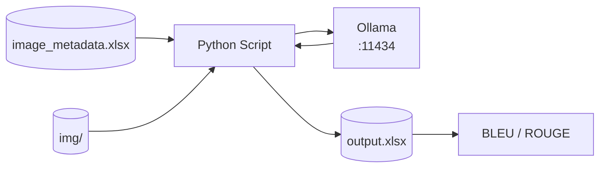
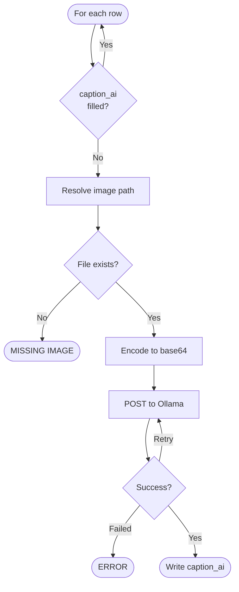
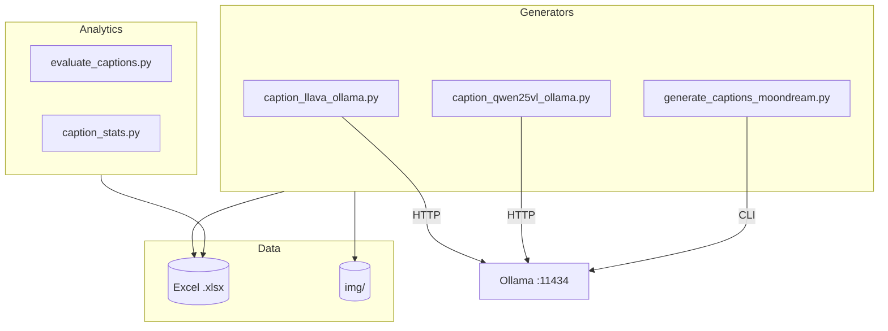

# Image Captioning for ITE Project Documentation

A research toolkit that automatically generates technical English captions for engineering lab photographs using **local** Vision-Language Models — no cloud, no data leaves the machine.

> For installation and setup steps, see **[WINDOWS_QUICKSTART.md](WINDOWS_QUICKSTART.md)**

---

## How It Works

The pipeline reads an Excel metadata file, resolves each image from the filesystem, sends it to a locally running VLM via Ollama, and writes the generated caption back to the spreadsheet.



---

## Per-Image Processing Flow

Every row in the Excel file goes through this decision loop before anything is written:



After all rows are processed, the entire DataFrame is saved to the output `.xlsx` in a single write.

---

## System Components



Each script is standalone — they share the same Excel schema and image folder convention but have no shared code.

---

## Data Model

The Excel file is the only datastore. Each row represents one image:

| Column | Role |
|--------|------|
| `project_id` | Metadata identifier |
| `category` | Maps to `img/<category>/` folder (`Reflector`, `RU`, `RU-Montage`, `Visits`) |
| `image_id` | Filename stem — used to locate the image file |
| `caption` | Human ground-truth caption (input to evaluation) |
| `caption_ai` | Generated by the script (empty → filled; sentinels on failure) |

Image path is resolved as: `img/<category>/<image_id>.<ext>` with automatic extension probing.

---

## Model Comparison

| Script | Model | Ollama interface | Post-processing | Speed (GPU) |
|--------|-------|-----------------|-----------------|-------------|
| `caption_llava_ollama.py` | `llava:7b` | HTTP REST | None | ~5–10 s/img |
| `caption_qwen25vl_ollama.py` | `qwen2.5vl:3b` | HTTP REST + `options` | None | ~8–15 s/img |
| `generate_captions_moondream.py` | `moondream:1.8b` | CLI subprocess | `clean_caption()` hallucination filter | ~3–6 s/img |

All models run **offline** after the initial `ollama pull`.

---

## Evaluation Flow

Once captions are generated, `evaluate_captions.py` computes corpus-level metrics against human ground-truth:

```
output.xlsx
  └── filter rows where both caption and caption_ai are non-empty
        ├── Corpus BLEU  (SacreBLEU)
        ├── ROUGE-1 F1   (mean across pairs)
        └── ROUGE-L F1   (mean across pairs)
              └── repeated per category: Reflector / RU / RU-Montage / Visits
```

Run it with:
```powershell
python evaluate_captions.py --excel output\results.xlsx
python caption_stats.py output\results.xlsx   # word-count statistics
```

---

## Resumability & Error Handling

The pipeline is designed to be safely re-run at any time:

- Rows with an existing `caption_ai` value are **skipped** automatically
- Use `--overwrite` to force regeneration of all rows
- Failed rows are marked with sentinel strings — they stay in the sheet and do not block the batch

| Sentinel | Meaning |
|----------|---------|
| `[MISSING IMAGE]` | File not found at resolved path |
| `[ERROR]` | Ollama returned an error after all retries |

---

## Codebase Walkthrough

### Core modules

#### `caption_llava_ollama.py` — primary entry point

| Function | Responsibility |
|----------|----------------|
| `find_image_file` | Extension-aware lookup in `img/<category>/` |
| `image_to_base64` | Binary read + base64 encode |
| `test_ollama_connection` | Pre-flight health check via `GET /api/tags` |
| `generate_caption` | HTTP POST with retries |
| `process_excel` | Batch orchestration + summary stats |
| `main` | CLI entry |

> **Note:** The script contains a duplicate `PROMPT_TEXT` assignment — the second strict SYSTEM/USER block is wrapped in a triple-quoted string and is inactive. The **active prompt is the shorter 12–18 word version**.

#### `caption_qwen25vl_ollama.py`

Same structure as LLaVA but adds an `options` dict for decoding parameters (`temperature`, `top_p`, `top_k`). Uses `find_image_file(base_path)` where `base_path = img_root / category / image_id`.

#### `generate_captions_moondream.py`

| Function | Responsibility |
|----------|----------------|
| `clean_caption` | Heuristic post-processing for hallucinations |
| `normalize_for_ollama` | Path format for CLI |
| `generate_caption_with_moondream` | Subprocess `ollama run` |
| `main` | Batch loop; skips missing images without writing a sentinel |

#### `evaluate_captions.py`

Pure metric computation. Has no awareness of `[ERROR]` sentinels — filter them before running evaluation.

#### `caption_stats.py`

Minimal word-count analytics utility.

#### `BertScore.py`

**Empty placeholder** — planned semantic similarity metric mentioned in the research paper, not yet implemented.

---

### Version variants

| File | What changed |
|------|-------------|
| `caption_llava_ollama_v1.0.py` | Uses `llava:latest`; resolves paths without extension probing |
| `generate_captions_moondream_v1.0.py` | Earlier Moondream subprocess integration |
| `generate_captions_moondream_v1.1.py` | Uses `ollama.chat` SDK + 12-word caption truncation |

---

### Shared conventions across all scripts

- Image categories: `["Reflector", "RU", "RU-Montage", "Visits"]`
- Banned prompt tokens: `urn`, `ids`, `idsignature`, `ers`
- Engineering notebook tone enforced across all models

---

### Non-runtime files

| File | Role |
|------|------|
| `WINDOWS_QUICKSTART.md` | Operator setup and onboarding |
| `cli/POWERSHELL_COMMANDS.ps1` | Copy-paste validation commands |
| `TeX/samplepaper.tex` | Research paper with experimental results and dataset description |
| `prompts/Moondream.txt` | Original Moondream prompt requirements spec |

---

## Project Structure

```
image-captioning/
├── caption_llava_ollama.py         ← recommended entry point
├── caption_qwen25vl_ollama.py
├── generate_captions_moondream.py
├── evaluate_captions.py
├── caption_stats.py
├── requirements.txt
├── WINDOWS_QUICKSTART.md           ← setup & install guide
├── data/image_metadata.xlsx        ← 120-row benchmark
├── img/<category>/                 ← source images
└── output/                         ← experiment results
```

---

## Quick Start using Moondream (Assuiming you have Python WPy64-3119 or WPy64-3.13.12.0).

### 1) Install Ollama. 

### 2) Download Moondream from the command line or Ollama GUI.

### 3) Start Ollama and select Moondream as base model.

### 4) Install dependencies from the requirements file.

### 5) To test image-captioning, run the Moondream model from command line like:
python generate_captions_moondream.py --excel demo/ic_demo.xlsx --output demo/ic_demo_with_moondream.xlsx


---

## License

MIT © 2025 Osama Hamed